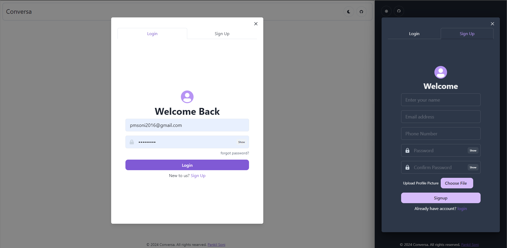
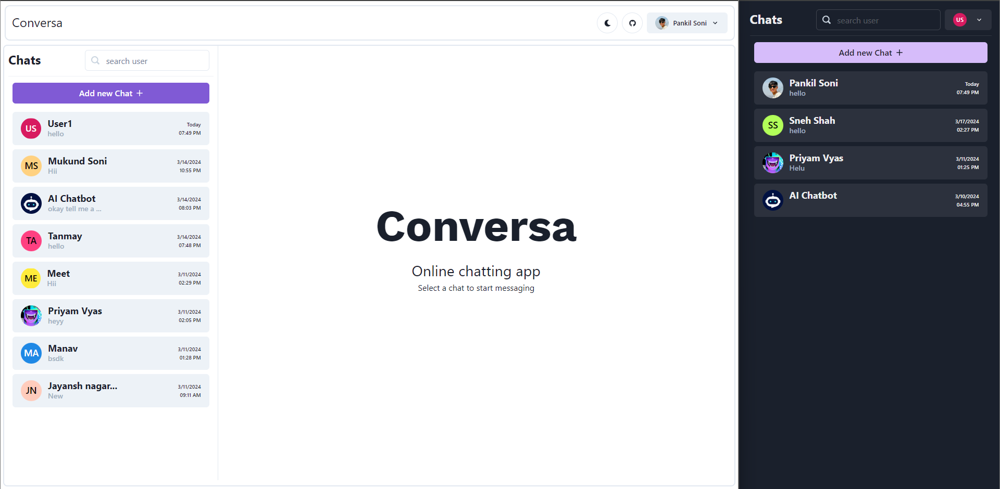
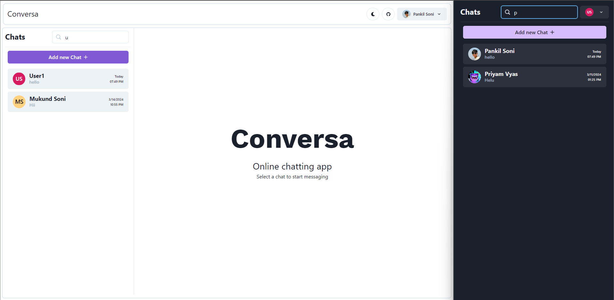
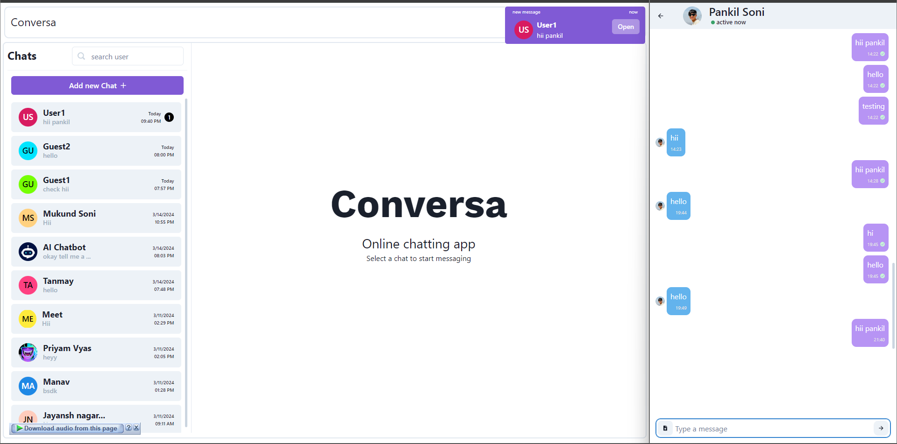

<div align="left" style="position: relative;">
  
<div style="display: flex; justify-content: space-between; align-items: center; width: 100%;">
  <div>
    <h1>Conversa - MERN Chatting Application</h1>
    <em>Connect, Code, Converse - Anywhere, Anytime with MERN Chat App!</em>
    <p>A full-stack MERN (MongoDB, Express.js, React.js, Node.js, Socket.IO) online chatting application 💬 with friends additionally with a Personal Chatbot. 🤖</p>
  </div>
</div>
## 🚀 Getting Started

### ☑️ Prerequisites

- **Version Controller** Git
- **Programming Language:** JavaScript/Node.js
- **Package Manager:** Npm

### ⚙️ Installation

Install mern-chat-app using one of the following methods:

**Build from source:**

1. Navigate to the project directory:
	```
	cd mern-chat-app
	```

2. Setup Backend
	- Install Dependencies
	    ```
	    cd backend
	    npm install
	    ```
   - Setup Environment: Create a **.env** file in the backend folder and add necessary environment variables.
	    ```
	    PORT=5000
	    GENERATIVE_API_KEY = ""
	    MONGO_URI = ""
	    EMAIL = ""
	    PASSWORD= ""
	    CLOUDINARY_ClOUD_NAME = ""
	    CLOUDINARY_API_KEY = ""
	    CLOUDINARY_API_SECRET = ""
	    JWT_SECRET = ""
	    AWS_ACCESS_KEY = ""
	    AWS_SECRET = ""
	    AWS_BUCKET_NAME = ""
	    ```
    
3. Setup Frontend
	- Install Dependencies
	    ```
	    cd frontend
	    npm install
	    ```

### 🤖 Usage

1. Start the backend server:
    ```
    cd backend
    nodemon ./index.js
    ```
2. Start the frontend development server:
    ```
    cd frontend
    npm run start
    ```
---	
### Conversa is a chat-app with various features like:
-   🔐 **Authentication**:  
    ✨ SignUp,  
    🔑 Login,  
    📲 Login with OTP,  
    📸 Profile Photo Uploading.
    
-   🎨 **Styling/Theming**:  
    🌐 A fully responsive app,  
    🌙 Dark and ☀️ Light mode.
    
-   🤖 **Personalized AI Chatbot**:  
    🧠 Remembers the context for personalized interactions.
    
-   🌐 **Web Sockets**:  
    💬 Real-time chatting,  
    🔔 Message Notifications,  
    🖋️ Real-Time Typing Animation,  
    ❌ Message Deletion,  
    🟢 Active Now / ⌛ Last Seen status tracking,  
    ✅ Message Seen status,  
    🖼️ Sending Image messages with captions.

</p>

<p align="left">Built with the tools and technologies:</p>
<p align="left">
	
   [](https://nodejs.org/) [](https://developer.mozilla.org/en-US/docs/Web/HTML) [](https://expressjs.com/) [](https://socket.io/)   [](https://www.docker.com/) 
</p>
</div>

## 📍 Overview

The MERN-Chat-App is a cutting-edge solution designed to streamline real-time communication. It leverages the MERN stack (MongoDB, Express.js, React, and Node.js) to offer a robust, scalable chat application. Key features include real-time communication with features like other trending social media applications and seamless integration with cloud services like AWS S3, Google Cloud's AI.

## 📸 Screenshots

<table>
  <tr>
    <td>
      
    </td>
    <td>
      
    </td>
  </tr>
  <tr>
    <td align="center">Dark/Light Mode and Responsive Website</td>
    <td align="center">Authentication</td>
  </tr>
  <tr>
    <td>
      
    </td>
    <td>
      
    </td>
  </tr>
  <tr>
    <td align="center">Responsive Dashboard</td>
    <td align="center">New Chat</td>
  </tr>
  <tr>
    <td>
      
    </td>
    <td>
      
    </td>
  </tr>
  <tr>
    <td align="center">Smooth Searching</td>
    <td align="center">Chatting Area & Real-time Communication</td>
  </tr>
  <tr>
    <td>
      
    </td>
    <td>
      
    </td>
  </tr>
  <tr>
    <td align="center">New Message Real-time Notification</td>
    <td align="center">Typing Animation</td>
  </tr>
  <tr>
    <td>
      
    </td>
    <td>
      
    </td>
  </tr>
  <tr>
    <td align="center">Message Management</td>
    <td align="center">Active Now Status</td>
  </tr>
  <tr>
    <td>
      
    </td>
    <td>
      
    </td>
  </tr>
  <tr>
    <td align="center">Message Seen Status</td>
    <td align="center">Personalized Chatbot</td>
  </tr>
  <tr>
    <td>
      
    </td>
    <td>
      
    </td>
  </tr>
  <tr>
    <td align="center">Image Messages</td>
    <td align="center">Login using OTP</td>
  </tr>
</table>

---
# Conversa-online-chatting-app
